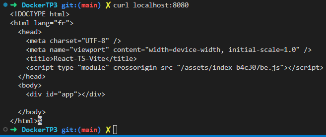

#### Exercice 4

Créez un fichier Dockerfile à la racine du projet. Celui-ci doit se diviser en deux grandes parties (Construction de l'application / Serveur web pour l'application)

```bash
FROM node:18-alpine as build
WORKDIR /app
COPY package.json ./
RUN yarn install --production=true
COPY . .
RUN yarn run build
FROM nginx:alpine
WORKDIR /usr/share/nginx/html
RUN rm -rf ./*
COPY --from=build /app/dist .
ENTRYPOINT ["nginx", "-g", "daemon off;"]
```

#### Exercice 5 :

Instanciez l’image créé précédemment afin d’observer le même résultat que lors de la question 3

Création de l'image :

```bash
docker build -t ma_super_app .
```

Lancer le conteneur :

```bash
docker run --name container_super_app -d -p 8080:80 ma_super_app
```

